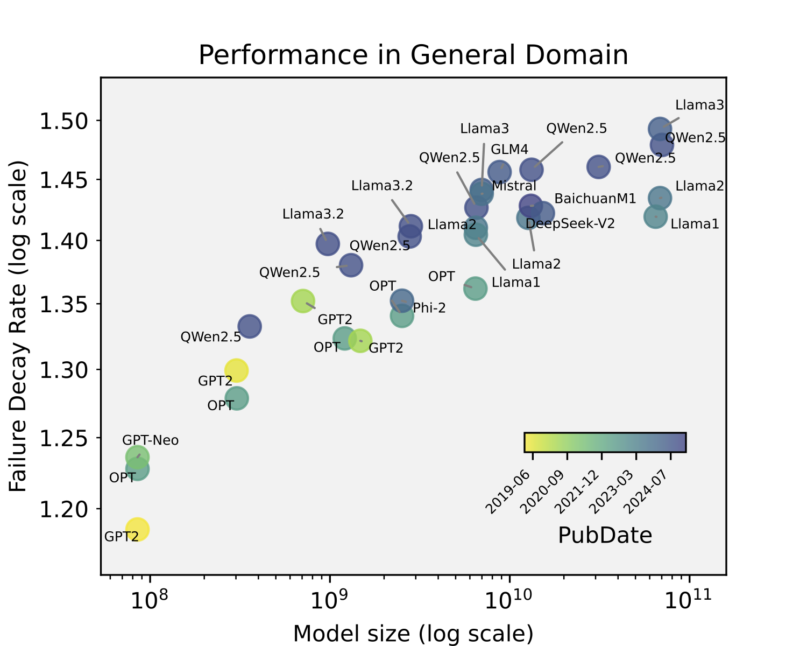
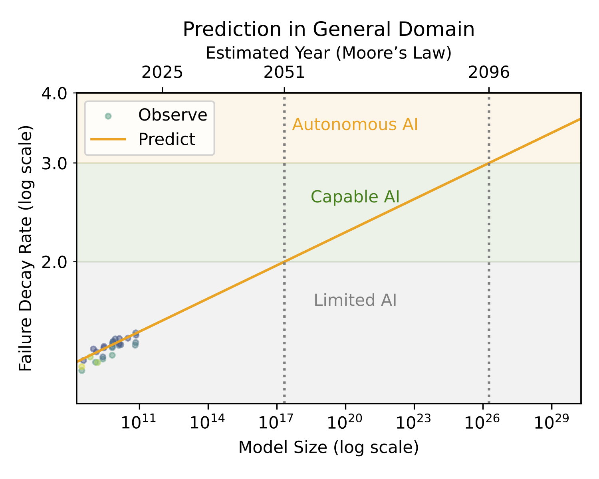

# Survival Game

<p align="left">
    <a href="https://arxiv.org/abs/2502.18858">
    
    </a>
    <a href="https://github.com/jingtaozhan/IntelligenceTest/blob/main/LICENSE">
    
    </a>
    <a>
    <a href="https://pytorch.org">
    
    </a>
</p>

Inspired by Natural Selection, we propose an evaluation framework for AI system, termed **Survival Game**.  Similar to how species find a way to survive through trial and error in Natural Selection, **Survival Game** evaluates whether the AI system can find correct solutions autonomously in a trial-and-error process. It counts the number
of failures before finding the correct solution. Fewer failures correspond to higher intelligence. When applied to practical tasks, the number of failures is a discrete random variable, and smaller expectations and variances of the failure count indicate higher intelligence.

Based on the convergence of the expectations and variances of failure count, the **Survival Game** divides intelligence into three levels: Limited,
Capable, and Autonomous.

- If the expectation diverges, the subject is at the Limited Level. At this level, the subject is comparable to blindly enumerating possible solutions.
- If the expectation converges but the variance diverges, the subject reaches the Capable Level. At this level, the subject can find the correct solution in principle but it is highly unstable. Thus, the subject is capable but not trustworthy.
- If both the expectation and variance converge, the subject reaches the Autonomous Level. At this level, the subject can stably find the correct solution with only a few trials, thereby being able to autonomously operate at an affordable cost.

> For more details, please refer to our paper: [Evaluating Intelligence via Trial and Error](https://arxiv.org/abs/2502.18858)

Current AI Systems   |  Future Trend
:-------------------------:|:-------------------------:
  |  

## Environment

This repo is developed with Python 3.10. The following packages are required:

- PyTorch
- Datasets
- Transformers
- OpenClip (For vision tasks)
- Faiss (For vision tasks & search tasks)
- ir_datasets(For search tasks)

## Examples

We provide the example evaluation scripts for vision, search, recommendation, and language:

- **Vision**: [Text-to-Image](./vision_text2image.ipynb)
- **Language**: [Writing (Prefix-to-NextToken)](./language_writing.ipynb), [Question-to-Answer](./language_qa.ipynb)
- **Search**: [Query-to-Document](./search_query2doc.ipynb)
- **Recommendation**: User-to-Item (coming soon)

## Citation

If you use **Survival Game** in your research, please cite this paper:

```
@misc{zhan2025evaluating,
      title={Evaluating Intelligence via Trial and Error}, 
      author={Jingtao Zhan and Jiahao Zhao and Jiayu Li and Yiqun Liu and Bo Zhang and Qingyao Ai and Jiaxin Mao and Hongning Wang and Min Zhang and Shaoping Ma},
      year={2025},
      eprint={2502.18858},
      archivePrefix={arXiv},
      primaryClass={cs.AI},
      url={https://arxiv.org/abs/2502.18858}, 
}
```
